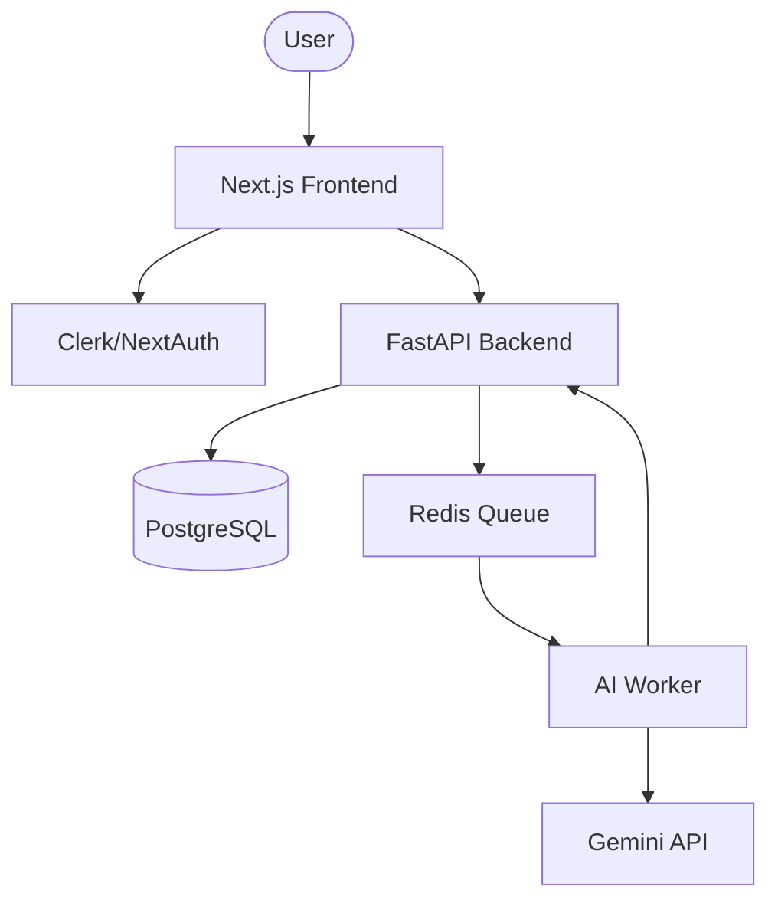

# AlgoMortem System Design

## 1. High-Level Architecture
AlgoMortem follows a modern full-stack architecture with a focus on real-time AI interaction.

- **Frontend**: Next.js (App Router) + TailwindCSS + Zustand (State Management)
- **Backend**: Python (FastAPI) + PostgreSQL (Database) + Redis (Task Queue)
- **AI Engine**: Gemini 2.0 Flash / GPT-4o (via LangChain/LangGraph)
- **Deployment**: Vercel (Frontend) + Render/AWS (Backend)

## 2. Component Diagram

## 3. Key Technical Challenges

### 3.1. The Dry-Run State Machine
The core of the app is the variable grid. Each row represents a state transition. 
- The backend must validate the state transition. 
- *Challenge*: How to validate if a dry-run is \"correct\" without knowing the user's specific intended algorithm?
- *Solution*: Compare the user's dry-run values against a \"Source of Truth\" execution of the optimal code solution. If they deviate, trigger the AI to analyze if the deviation is an error or just a different valid approach.

### 3.2. Real-time AI "Anti-Hints"
We don't want to call the LLM on every keystroke (cost/latency).
- *Strategy*: AI is triggered when:
    1. User clicks \"Commit Step\".
    2. User hits a \"Logic Checkpoint\" (e.g., end of a loop).
    3. User manually asks for a logic audit.

### 3.3. Spreadsheet Performance
A dry-run for a complex problem (like a matrix search) could have 50+ steps with 10+ variables.
- *Strategy*: Virtualized lists for the grid to keep the UI snappy.

## 4. Data Flow (AI Feedback)
1. User submits a `DryRunStep`.
2. Backend checks for obvious manual trace errors (e.g., $i$ was 5, now it's 3, but loop is $i++$).
3. If no obvious error, LLM compares the *current state* + *logic plan* + *problem constraints*.
4. LLM generates an \"Anti-Hint\" if a logical trap is detected.
5. Push notification via WebSockets/SSE to the frontend.
